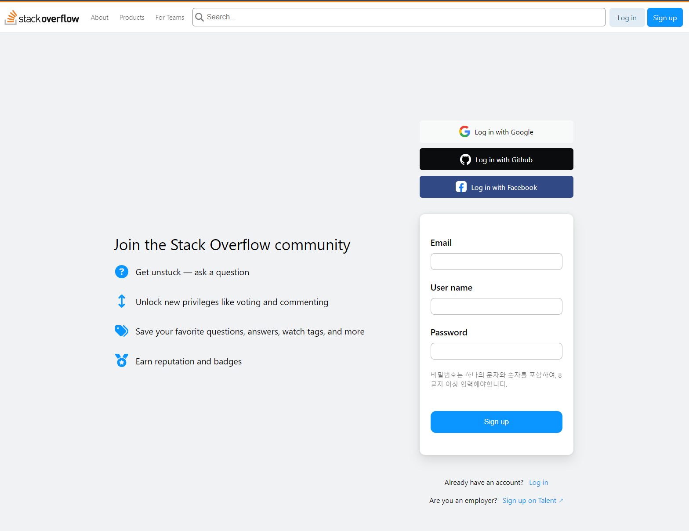
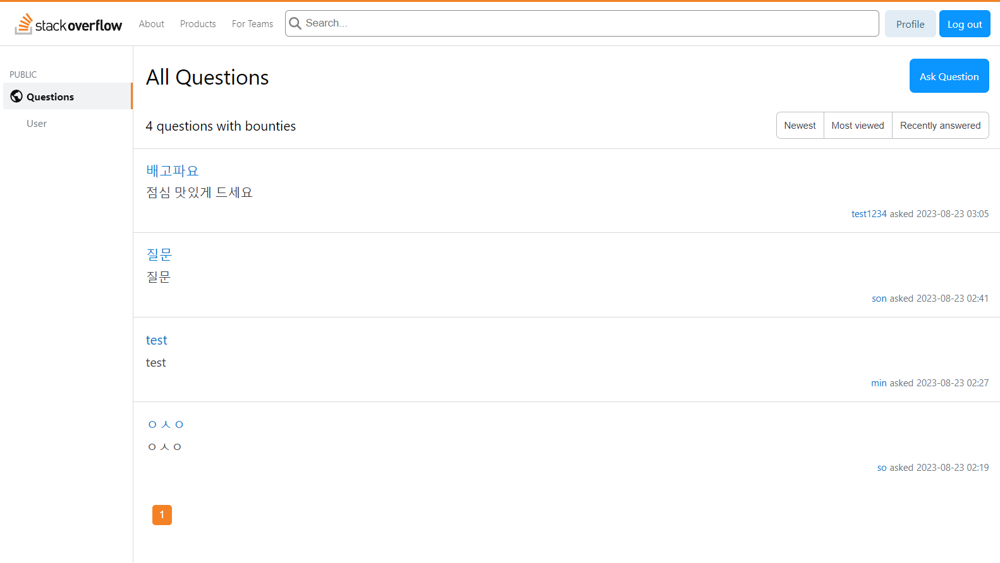
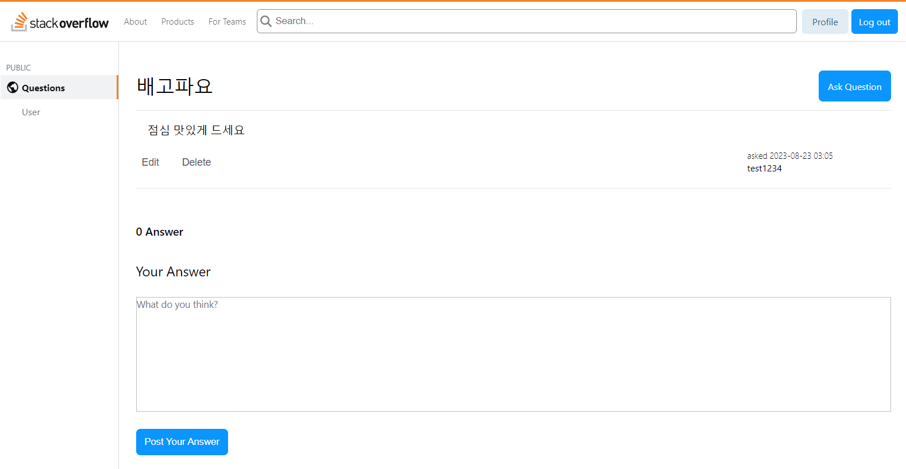
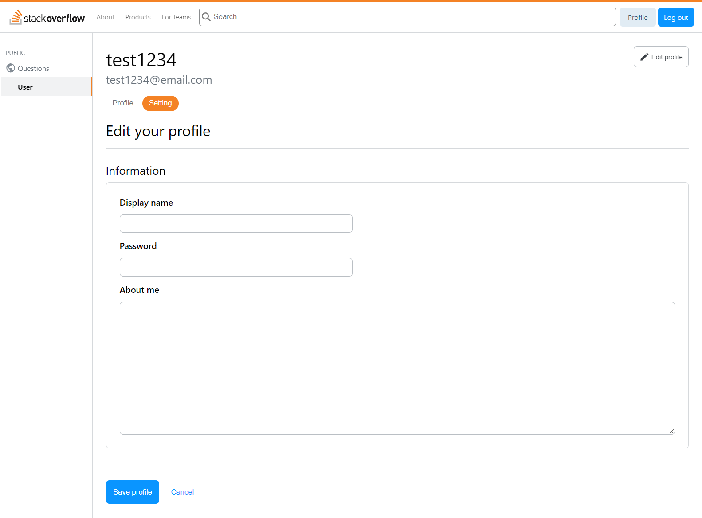

# Stackoverflow

**팀 이름** : 어떻게든 되겠지  
**프로젝트 기간** : 2023-08-04 ~ 2023-08-23

### Team members

| 이마루한(FE) | 박진주(FE) | 김남구(FE) | 민은영(BE) | 김소연(BE) | 손우진(BE) |
:----: | :----: | :----: | :----: | :----: | :----: |
|  |  |  |   |  |   |
|[ddussi](https://github.com/ddussi) | [pearl-sea](https://github.com/pearl-sea) | [Kim-NamGoo](https://github.com/Kim-NamGoo) | [minkawoo](https://github.com/minkawoo) | [bonbon0808](https://github.com/bonbon0808) | [uudean](https://github.com/uudean) |

### Stacks

  

 

  

### Team rules
* **프로젝트 일반 규칙**
  - 탈주 금지
  - 일정 불참 사항 공유하기 최소 2일전
  - 3회 지각시 룰렛 돌리기 (10시 기준으로)
  - 의견 다수결로 정하기  

* **개발 관련 규칙**
  - 모르는 건 솔직하게 말하기
  - 변수명 명확하게 작성하기(i, j 쓰지 않기)
  - PR하면 디스코드로 알리기

### Documents

개발자 테스트 체크리스트

패스율 : 88%

| No | 카테고리 | 요구 사항 | 설명 | 결과 | 비고 |
| --- | --- | --- | --- | --- | --- |
| 1 | 회원가입 | 회원 가입 | 회원 가입 시 사용자가 입력한 정보가 데이터베이스에 저장되며 이때 패스워드는 암호화되어야 합니다. | O |  |
| 2 | 회원가입 | 로그인 | 이메일 형식의 아이디와 패스워드를 직접 입력합니다. | O |  |
| 3 | 회원가입 | 로그아웃 | 로그인 된 사용자는 로그아웃할 수 있습니다. | O |  |
| 4 | 회원가입 | 회원 정보 표시 | 사용자 이름을 확인 할 수 있는 프로필 화면을 제공합니다. | O |  |
| 5 | 회원가입 | 회원 정보 수정 | 본인 정보 중 이메일을 제외한 나머지 정보는 수정이 가능합니다 | O |  |
| 6 | QnA | 질문 조회 | 질문 글 원문과 답변 내용을 노출합니다. | O |  |
| 7 | QnA | 질문 등록 | 로그인 한 사람만 질문을 작성할 수 있습니다. 질문에는 제목, 내용이 들어가고 해당 유저의 닉네임이 표시됩니다. | O |  |
| 8 | QnA | 질문 수정 | 질문 글을 작성한 사람만 수정 가능합니다. | O |  |
| 9 | QnA | 질문 삭제 | 질문 글을 작성한 사람만 삭제 가능합니다. | O |  |
| 10 | QnA | 질문 리스트 | 각 항목에 제목, 작성자, 작성 시간을 노출합니다. | O |  |
| 11 | QnA | 리스트 조회 순서 변경 | 최신순, 조회순, 최근 답변 달린 순으로 리스트 조회 순서를 변경할 수 있습니다. | X |  |
| 12 | QnA | 답변 등록 | 로그인 한 사람만 질문을 작성할 수 있습니다. 답변에는 내용과 해당 유저의 닉네임이 표시됩니다.| O |  |
| 13 | QnA | 답변 수정 | 답변을 작성한 사람만 수정 가능합니다. | O |  |
| 14 | QnA | 답변 삭제 | 답변을 작성한 사람만 삭제 가능합니다. | O |  |
| 15 | QnA | 답변 리스트 | 상세 페이지 질문 영역 바로 아래에서 모든 답변을 리스트 형태로 확인 할 수 있습니다. | O |  |
| 16 | QnA | 답변 채택 | 질문 게시자는 답변 중 마음에 드는 답변을 1개 채택할 수 있으며 채택된 답변은 하이라이트로 표시하여 일반 답변과 구분합니다. | X |  |
| 17 | QnA | paginaiton | 질문리스트에 paginaiton 적용합니다. | O |  |

테이블 명세서

| 데이터 베이스 명 | stackoverflow | 테이블 명 | Member |
| --- | --- | --- | --- |
| 요구사항 ID | USER_01, USER_02,
USER_03, USER_04,
USER_05 | 테이블 설명 | 회원 가입을 통한 로그인 대상 관리 및 회원 정보 조회, 수정 |

| 컬럼 ID | 타입 및 길이 | Not null | PK | FK | 엔티티 매핑 |
| --- | --- | --- | --- | --- | --- |
| member_id | BIGINT | Y | Y |  |  |
| password | VARCHAR(10) | Y |  |  |  |
| name | VARCHAR | Y |  |  |  |
| email | VARCHAR | Y |  |  |  |
| role | VARCHAR | Y |  |  |  |
| createdAt | TIMESTAMP | Y |  |  |  |
| modifiedAt | TIMESTAMP | Y |  |  |  |

| 데이터 베이스 명 | stackoverflow | 테이블 명 | Question |
| --- | --- | --- | --- |
| 요구사항 ID | QUESTION_01, QUESTION_02,
QUESTION_03, QUESTION_04,
QUESTION_05,
QUESTION_06 | 테이블 설명 | 질문 CRUD, 리스트 조회  |

| 컬럼 ID | 타입 및 길이 | Not null | PK | FK | 엔티티 매핑 |
| --- | --- | --- | --- | --- | --- |
| question_id | BIGINT | Y | Y |  |  |
| title | VARCHAR | Y |  |  |  |
| content | TEXT | Y |  |  |  |
| createdAt | TIMESTAMP | Y |  |  |  |
| modifiedAt | TIMESTAMP | Y |  |  |  |
| member_id | BIGINT | Y |  | Y | OneToMany |

| 데이터 베이스 명 | stackoverflow | 테이블 명 | Answer |
| --- | --- | --- | --- |
| 요구사항 ID | ANSWER_01, ANSWER_02,
ANSWER_03, ANSWER_04,
ANSWER_05, | 테이블 설명 | 답변 CRUD, 베스트 답변 채택  |

| 컬럼 ID | 타입 및 길이 | Not null | PK | FK | 엔티티 매핑 |
| --- | --- | --- | --- | --- | --- |
| answer_id | BIGINT | Y | Y |  |  |
| content | VARCHAR | Y |  |  |  |
| createdAt | TIMESTAMP | Y |  |  |  |
| modifiedAt | TIMESTAMP | Y |  |  |  |
| member_id | BIGINT | Y |  | Y | OneToMany |
| question_id | BIGINT | Y |  | Y | OneToMany |

[API 명세서](https://documenter.getpostman.com/view/27566939/2s9Y5R1ksN)

### Commit convention

| Message  | 설명                                            |
| -------- | ----------------------------------------------- |
| feat     | 새로운 기능 추가                                |
| fix      | 버그 수정                                       |
| refactor | 코드 리팩토링                                   |
| style    | 코드 포맷팅, 세미콜론 누락, 코드 스타일 변경 등 |
| remove   | 사용하지 않는 파일 또는 폴더 삭제               |
| rename   | 파일 또는 폴더명 수정                           |
| test     | 테스트 코드, 리펙토링 테스트 코드 추가          |
| docs     | 문서명 수정                                     |
| chore    | 빌드 업무 수정, 패키지 매니저 수정              |

### Preview
#### 회원가입 페이지  

#### 메인 페이지  

#### 질문 상세 페이지

#### 유저 프로필 페이지  

